# A+Bのみ：螺旋・分岐木の比較（seed 0）

C（楕円）とB–C橋を学習入力から削除し、PCA・通常UMAP・UMAPing Uniform/FitGridを再学習しました。A/Bの座標・ID・split・等長50D写像は前回と同一です。前回の図からCを非表示にしただけの結果ではありません。

内部点はA 2,001点＋B 1,998点＝3,999点、reference 2,666／query 1,333。sparse_bridgeにはA–B橋240点（reference160／query80）のみ追加します。両条件で内部点・splitは共通。seed 0の1回ずつです。

学習条件と評価式は[README](../../README.md)およびconfigsを継承。Uniform/FitGridはtrajectory・Retriever・Spectral・初期値・学習位置列を共有しteacherだけ変更。係数は引力1＋反発1、FitGrid256、Uniform64。通常UMAPはreferenceのみfitしてqueryをtransform。今回は両条件のreference数が4096未満で通常UMAPの距離全計算経路を使用。

入力kNN検査は橋なし2成分／橋あり1成分、橋除去後2成分。事前規則で別の巻き・枝への近道および意図しない構造間接触0。PCAによる元形状回復と、両teacherの上流一致も検証しました。

## 共通内部queryの比較

|condition|method|recall5|recall15|within_recall15|log_radius15|abs_log_radius15|
|---|---|---|---|---|---|---|
|disconnected|pca|1.0000|1.0000|1.0000|-0.0000|0.0000|
|disconnected|umap|0.6113|0.8402|0.8402|0.0122|0.2527|
|disconnected|uniform|0.6381|0.8117|0.8128|-0.0233|0.3083|
|disconnected|fitgrid|0.6390|0.8119|0.8130|-0.0224|0.3078|
|sparse_bridge|pca|1.0000|1.0000|1.0000|0.0000|0.0000|
|sparse_bridge|umap|0.6038|0.8328|0.8332|0.0230|0.2563|
|sparse_bridge|uniform|0.6392|0.8130|0.8150|-0.0336|0.3017|
|sparse_bridge|fitgrid|0.6392|0.8129|0.8149|-0.0327|0.3018|

半径誤差はreference全体から求めた単一倍率を補正した自然対数比です。負は圧縮、正は膨張。群別・query別の再スケーリングはせず、島の大きさだけで改善とはしません。

## 構造別・reference/query別

|condition|method|split|group|within_recall15|log_radius15|abs_log_radius15|
|---|---|---|---|---|---|---|
|disconnected|pca|reference|A_spiral|1.0000|0.0000|0.0000|
|disconnected|pca|reference|B_tree|1.0000|0.0000|0.0000|
|disconnected|pca|query|A_spiral|1.0000|-0.0000|0.0000|
|disconnected|pca|query|B_tree|1.0000|-0.0000|0.0000|
|disconnected|umap|reference|A_spiral|0.9262|-0.1216|0.1609|
|disconnected|umap|reference|B_tree|0.7613|0.2116|0.3631|
|disconnected|umap|query|A_spiral|0.9260|-0.1414|0.1753|
|disconnected|umap|query|B_tree|0.7543|0.1661|0.3301|
|disconnected|uniform|reference|A_spiral|0.8791|-0.1850|0.2771|
|disconnected|uniform|reference|B_tree|0.7559|0.2128|0.3413|
|disconnected|uniform|query|A_spiral|0.8829|-0.2020|0.2874|
|disconnected|uniform|query|B_tree|0.7426|0.1558|0.3293|
|disconnected|fitgrid|reference|A_spiral|0.8791|-0.1850|0.2771|
|disconnected|fitgrid|reference|B_tree|0.7559|0.2128|0.3413|
|disconnected|fitgrid|query|A_spiral|0.8834|-0.2010|0.2866|
|disconnected|fitgrid|query|B_tree|0.7425|0.1565|0.3289|
|sparse_bridge|pca|reference|A_spiral|1.0000|-0.0000|0.0000|
|sparse_bridge|pca|reference|B_tree|1.0000|0.0000|0.0000|
|sparse_bridge|pca|reference|bridge_AB|1.0000|-0.0000|0.0000|
|sparse_bridge|pca|query|A_spiral|1.0000|0.0000|0.0000|
|sparse_bridge|pca|query|B_tree|1.0000|0.0000|0.0000|
|sparse_bridge|pca|query|bridge_AB|1.0000|0.0000|0.0000|
|sparse_bridge|umap|reference|A_spiral|0.9113|-0.1184|0.1736|
|sparse_bridge|umap|reference|B_tree|0.7614|0.2235|0.3531|
|sparse_bridge|umap|reference|bridge_AB|0.9708|-0.2526|0.2526|
|sparse_bridge|umap|query|A_spiral|0.9131|-0.1358|0.1912|
|sparse_bridge|umap|query|B_tree|0.7532|0.1820|0.3215|
|sparse_bridge|umap|query|bridge_AB|0.9683|-0.2615|0.2615|
|sparse_bridge|uniform|reference|A_spiral|0.8879|-0.1269|0.2479|
|sparse_bridge|uniform|reference|B_tree|0.7584|0.1362|0.3524|
|sparse_bridge|uniform|reference|bridge_AB|0.9300|-0.0792|0.2164|
|sparse_bridge|uniform|query|A_spiral|0.8876|-0.1403|0.2614|
|sparse_bridge|uniform|query|B_tree|0.7423|0.0733|0.3421|
|sparse_bridge|uniform|query|bridge_AB|0.9283|-0.0910|0.2186|
|sparse_bridge|fitgrid|reference|A_spiral|0.8879|-0.1269|0.2479|
|sparse_bridge|fitgrid|reference|B_tree|0.7584|0.1362|0.3524|
|sparse_bridge|fitgrid|reference|bridge_AB|0.9300|-0.0792|0.2164|
|sparse_bridge|fitgrid|query|A_spiral|0.8874|-0.1398|0.2614|
|sparse_bridge|fitgrid|query|B_tree|0.7422|0.0745|0.3424|
|sparse_bridge|fitgrid|query|bridge_AB|0.9283|-0.0914|0.2185|

## 橋の保持

|method|split|bridge_edge_loss15|bridge_cross_edge_loss15|wrong_turn15|wrong_branch15|
|---|---|---|---|---|---|
|pca|reference|0.0000|0.0000|0.0000|0.0000|
|pca|query|0.0000|0.0000|0.0000|0.0000|
|umap|reference|0.0427|0.2098|0.0000|0.0000|
|umap|query|0.0432|0.1754|0.0000|0.0000|
|uniform|reference|0.1488|0.3636|0.0040|0.0000|
|uniform|query|0.1403|0.4211|0.0037|0.0000|
|fitgrid|reference|0.1488|0.3636|0.0040|0.0000|
|fitgrid|query|0.1395|0.4211|0.0037|0.0000|

## 図

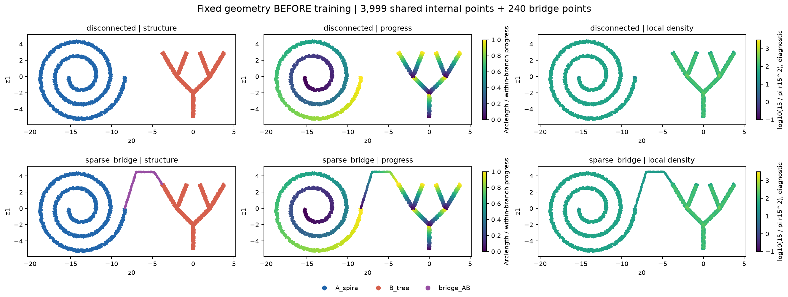

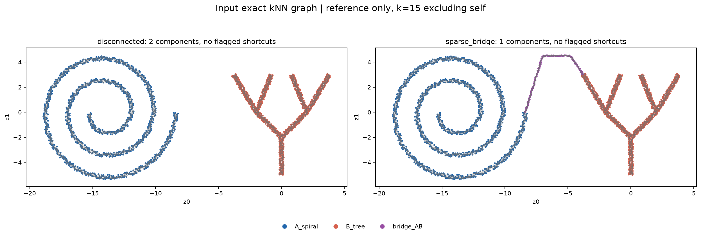

### disconnected

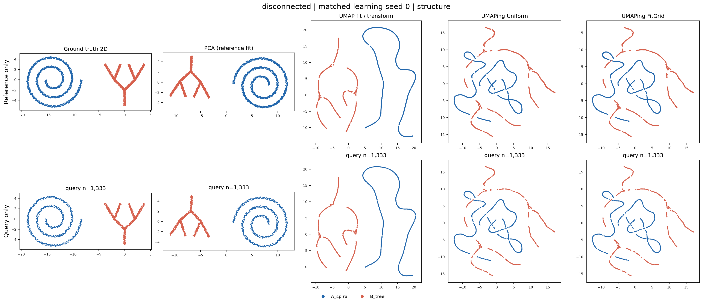

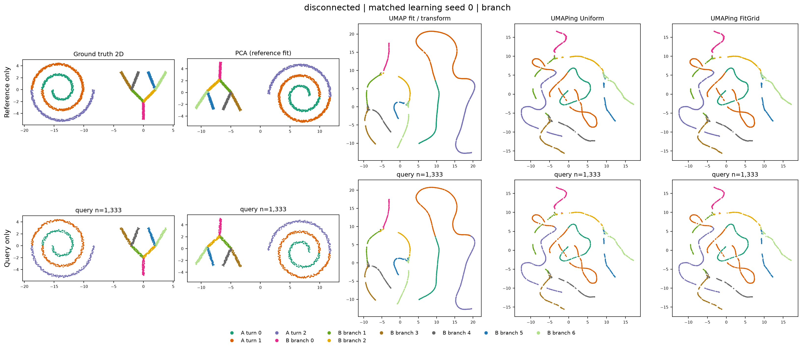

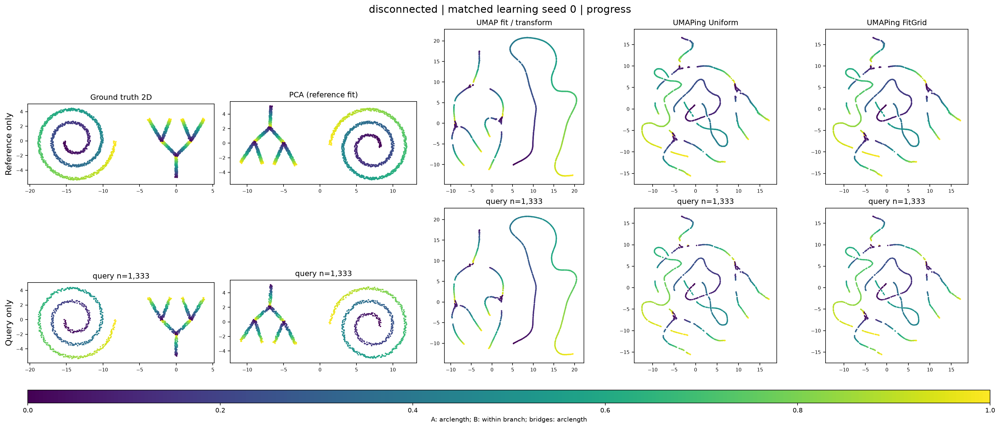

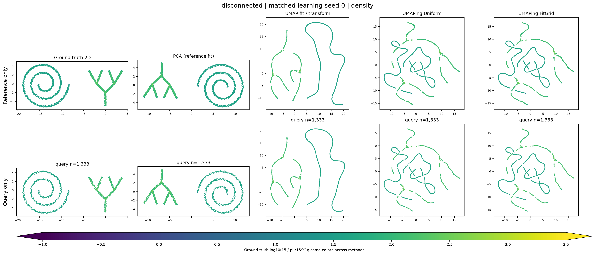

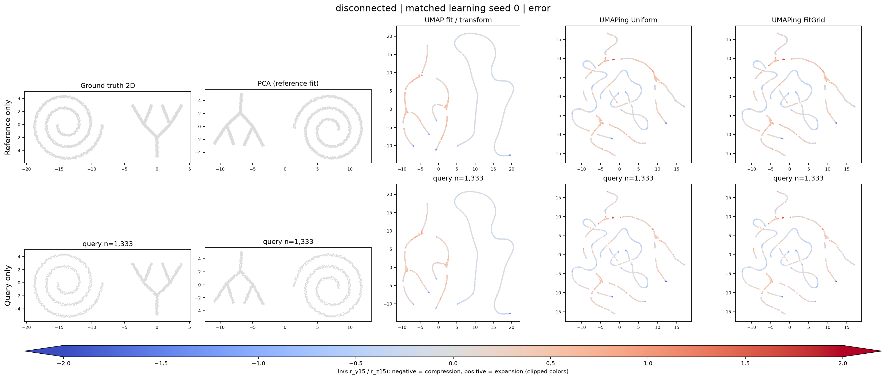

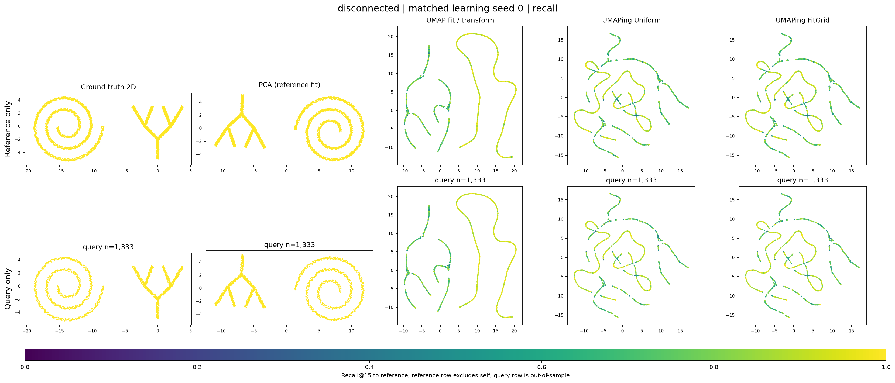

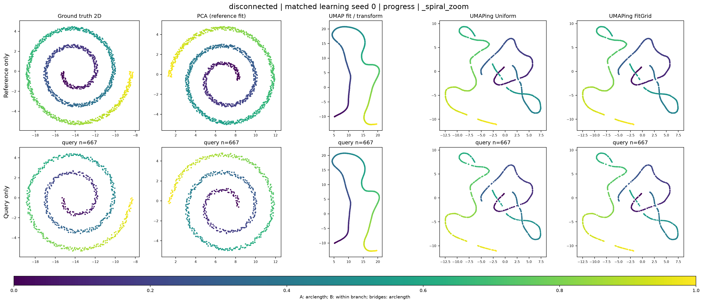

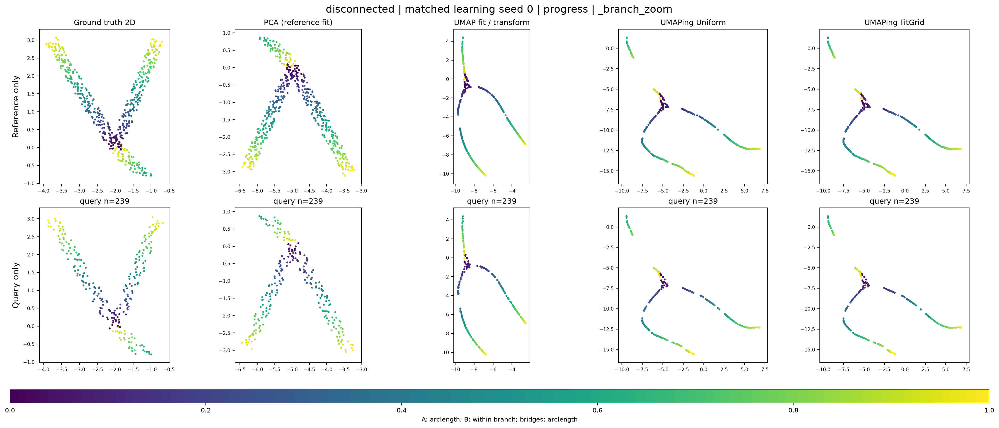

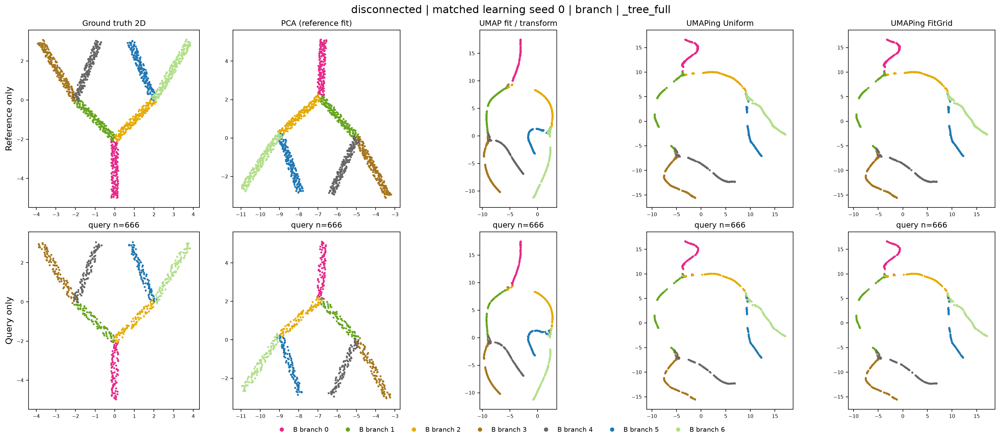

### sparse_bridge

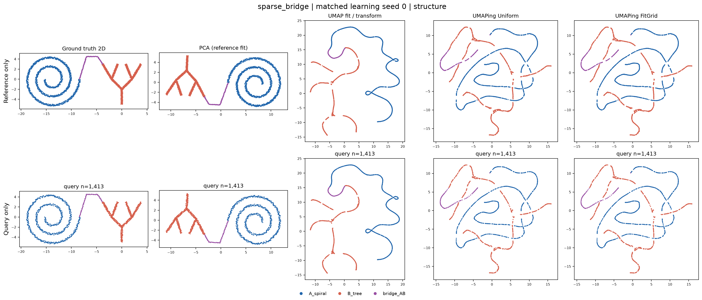

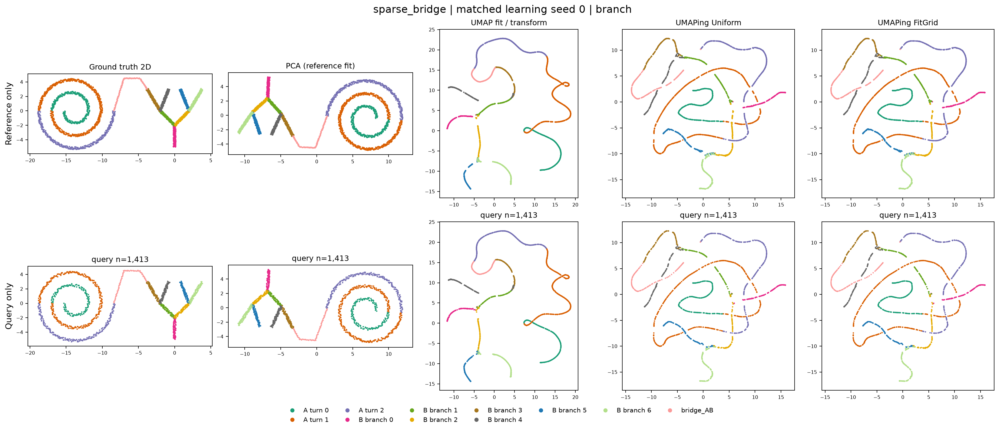

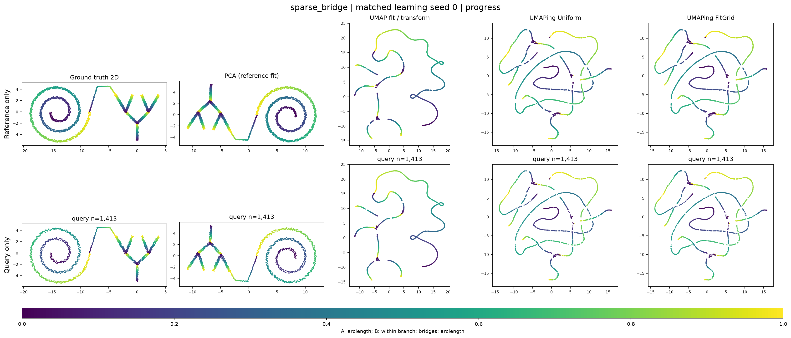


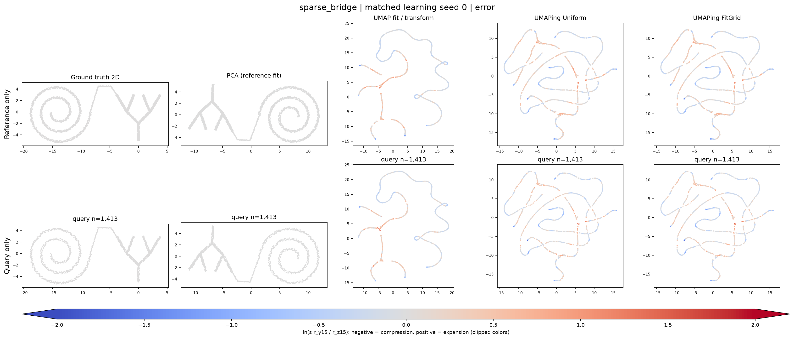


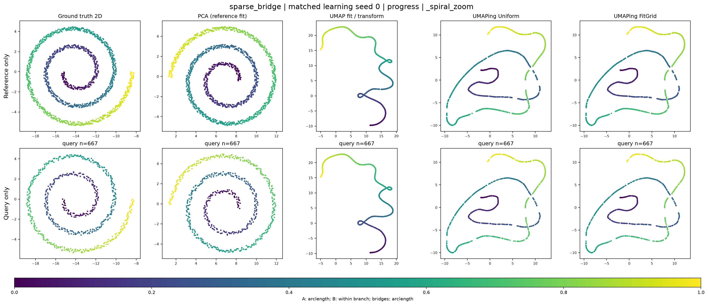

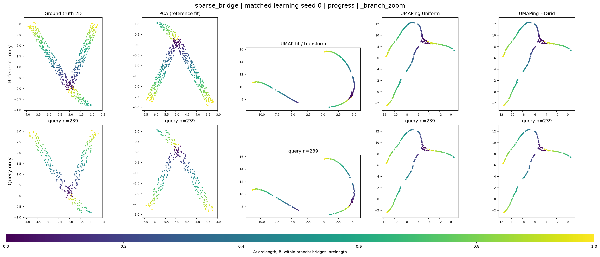

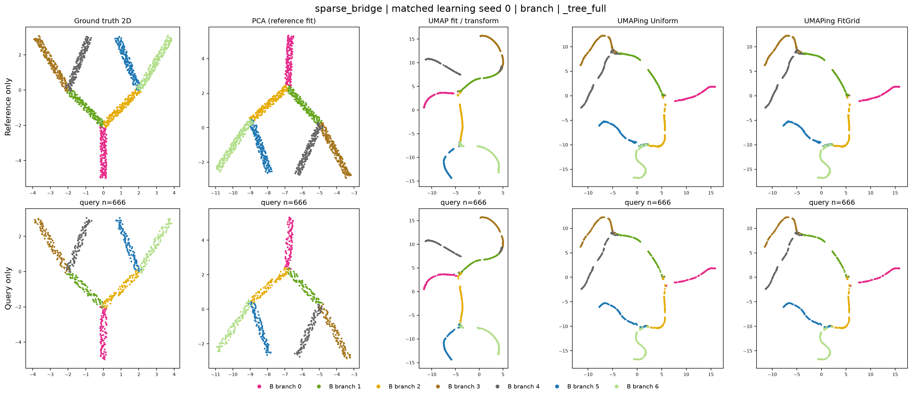

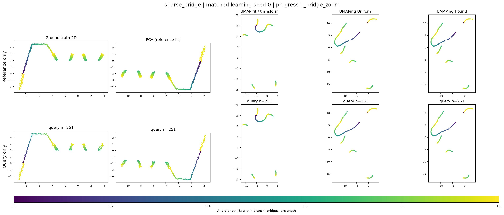

## 再実行

```sh
.venv/bin/python SyntheticAnalysis/scripts/run_ab.py --run SyntheticAnalysis/runs/20260918T043524_656398Z --phase train
.venv/bin/python SyntheticAnalysis/scripts/run_ab.py --run SyntheticAnalysis/runs/20260918T043524_656398Z --phase plot
```

所要時間（run開始から）5.58分。保存先はdata/models/embeddings/metrics/figures/logsに分離。PNGのみ保存、PDFなし。既存runは変更していません。

この無ノイズ等長写像条件・1 seedの観測であり、安定した優位性や高難度データへの一般化、引力過多を原因として断定しません。
