# Spectral output dimension comparison: A+B, seed 0

既存A+B runのデータ・ID・split・50D等長写像をそのままコピー。条件はdisconnectedとsparse_bridge。正解座標・構造ラベルは評価と作図だけに使用し、通常UMAPの座標や軌道を教師にしません。baseline_3_to_2は既存FitGrid結果を使用。通常UMAPと入力PCAの比較座標も再利用しました。

## 採用候補と結論

暫定的な追加検証候補はdirect_2。ただし置き換え採用を決める結果ではありません。内部queryの最終Within Recall@15と平均半径誤差は両条件で小幅改善した一方、橋ありの木のRecallは悪化し、木の距離順位相関は両条件で約0.91から約0.81へ低下しました。螺旋・木・橋あり/なしのすべてで一貫した改善ではありません。

100次元＋PCAは今回の採用候補にしません。最終局所Recallが両条件で低下し、上位PCA固有値の近接とbootstrapの大きな部分空間変動が観測されました。100次元の直交制約自体も十分には満たされておらず、「全100軸が等分散になった」とは解釈しません。

初期の改善がそのまま最終に残るという結果ではありません。direct_2は橋なしの初期Recallを改善しましたが、橋ありでは初期Recallが低下し、最終のみ小幅改善しました。全方式で25%時点のRecallが大きく低下し、その後回復します。初期からの重なりと更新中の追加変形の両方が残り、Spectral変更だけで変形・重なりを解消できたとは結論しません。

## 固定した数式・実装差

グラフは $L=I-D^{-1/2}WD^{-1/2}$。連結成分ごとに $T_{ic}=\sqrt{N}\sqrt{d_i}1[i\in c]/\sqrt{\sum_{j\in c}d_j}$ とおくと $T^TT/N=I$、$LT=0$。次数が不均一なため単なる平均0では自明モードを除けません。成分は入力グラフだけから求め、構造ラベルを使いません。

新2方式は出力 $Z=f_\theta(X_{ref})\in\mathbb R^{N\times r}$ に対して $[E_{edge}+\|Z^TZ/N-I_r\|_F^2+\|T^TZ/N\|_F^2]/r$ を最小化。$E_{edge}=\mathrm{mean}_{(i,j)\sim upper(W)}w_{ij}\|z_i/\sqrt{d_i}-z_j/\sqrt{d_j}\|^2$ は既存と同じ一様edge sampling4096本。各項をrで割り、既存のenergy対orthogonalityの係数比1を保ちつつ次元の総和増大を抑えます。直交性は新2方式で同じfull-reference Gramを用い、baselineのedge由来unique-node proxyとの違いもあります。従って出力次元だけの単独介入ではありません。

学習後、referenceだけから $B=T^TZ/N$ を求め、$Z_c=Z-TB$ として残存自明成分を除去。queryでは入力50Dの固定reference15近傍から逆距離重みでTを補間して $f_\theta(x)-t(x)B$ を適用。この補間はSpectral較正のためだけに使い、Dual Encoderの引力近傍は変更しません。queryバッチの平均・共分散・query-query graphは使いません。

- **direct_2**: r=2。自明成分補正後の2列をそのまま使い、追加モードを捨てず、白色化・Hによる選択もしません。
- **spectral_100_pca_2**: r=100。補正後referenceの中心化共分散にPCAをfitし、分散最大の2軸を採用。完全白色化なし。queryに同じprojectionを固定適用。Hは診断として記録するだけで軸選択に使いません。
- **baseline_3_to_2**: 既存3出力、soft Gram制約、完全白色化、Hの最小1モードを捨て次の2モードを選択。既存モデルは再学習しません。

2D較正は全方式でreference平均 $\mu$ と単一倍率 $s=10/\max_{i,d}|y_{id}-\mu_d|$。queryにも $(y-\mu)s$ を固定適用。hidden layers512/256 GELU、Adam lr0.001、Spectral2000 stepsは共通。新2方式のhidden layers初期値・edge抽選seedも共通。test成績で係数を調整していません。

同じdata条件では既存Dual Encoder・入力グラフ・保存済み検索IDを共有。独自reference dynamics200 steps、係数、乱数seedを維持。各新trajectoryごとに既存FitGrid256 teacherを再構築し、新しい反発ネットを共通初期値から4000 steps学習。teacher/学習位置サンプルのseedは既存と同じ。異なるtrajectoryの反発ネットは流用しません。

## 評価定義

既存Recall@5/15・構造内Recall・誤った巻き/枝・橋の欠落を再利用。半径誤差は、同じreference候補集合でz/yそれぞれのkNN半径を求め、referenceのmedian(log(rz15/ry15))から単一倍率sを決定しlog(s·ry/rz)を記録。負が圧縮、正が膨張。各stageごとにreferenceのみから倍率を決める相対局所スケール指標であり、島面積の評価ではありません。reference自身はself除外。構造/枝/橋・reference/query別に全stageを保存。

螺旋内Recall@50/100/200/400も同じ構造のreference候補に対して計算。距離順位は全体・螺旋・木ごと、reference同士/query同士の固定seed12345による最大20,000点対（self除外）を全方式・全stageで共有しSpearman相関を計算。点対はmetrics/<condition>/distance_pairs.npzに保存。

## 最終内部query比較

|condition|method|recall5|recall15|within_recall15|abs_log_radius15|wrong_turn15|wrong_branch15|
|---|---|---|---|---|---|---|---|
|disconnected|pca|1.0000|1.0000|1.0000|0.0000|0.0000|0.0000|
|disconnected|umap|0.6113|0.8402|0.8402|0.2527|0.0000|0.0000|
|disconnected|baseline_3_to_2|0.6390|0.8119|0.8130|0.3078|0.0045|0.0000|
|disconnected|direct_2|0.6371|0.8123|0.8154|0.2867|0.0000|0.0000|
|disconnected|spectral_100_pca_2|0.6333|0.7982|0.8017|0.3029|0.0024|0.0078|
|sparse_bridge|pca|1.0000|1.0000|1.0000|0.0000|0.0000|0.0000|
|sparse_bridge|umap|0.6038|0.8328|0.8332|0.2563|0.0000|0.0000|
|sparse_bridge|baseline_3_to_2|0.6392|0.8129|0.8149|0.3018|0.0039|0.0000|
|sparse_bridge|direct_2|0.6398|0.8112|0.8161|0.2873|0.0027|0.0000|
|sparse_bridge|spectral_100_pca_2|0.6384|0.7994|0.8044|0.3187|0.0057|0.0014|

## 初期→最終：reference/queryと構造別

|condition|method|stage|split|group|within_recall15|abs_log_radius15|
|---|---|---|---|---|---|---|
|disconnected|pca|1.0000|reference|A_spiral|1.0000|0.0000|
|disconnected|pca|1.0000|reference|B_tree|1.0000|0.0000|
|disconnected|pca|1.0000|query|A_spiral|1.0000|0.0000|
|disconnected|pca|1.0000|query|B_tree|1.0000|0.0000|
|disconnected|umap|1.0000|reference|A_spiral|0.9262|0.1609|
|disconnected|umap|1.0000|reference|B_tree|0.7613|0.3631|
|disconnected|umap|1.0000|query|A_spiral|0.9260|0.1753|
|disconnected|umap|1.0000|query|B_tree|0.7543|0.3301|
|disconnected|baseline_3_to_2|0.0000|reference|A_spiral|0.6335|0.6933|
|disconnected|baseline_3_to_2|0.0000|reference|B_tree|0.7930|1.0106|
|disconnected|baseline_3_to_2|0.0000|query|A_spiral|0.6431|0.6846|
|disconnected|baseline_3_to_2|0.0000|query|B_tree|0.7998|1.0074|
|disconnected|baseline_3_to_2|1.0000|reference|A_spiral|0.8791|0.2771|
|disconnected|baseline_3_to_2|1.0000|reference|B_tree|0.7559|0.3413|
|disconnected|baseline_3_to_2|1.0000|query|A_spiral|0.8834|0.2866|
|disconnected|baseline_3_to_2|1.0000|query|B_tree|0.7425|0.3289|
|disconnected|direct_2|0.0000|reference|A_spiral|0.7463|0.3379|
|disconnected|direct_2|0.0000|reference|B_tree|0.7530|0.2220|
|disconnected|direct_2|0.0000|query|A_spiral|0.7478|0.3300|
|disconnected|direct_2|0.0000|query|B_tree|0.7593|0.2174|
|disconnected|direct_2|1.0000|reference|A_spiral|0.8857|0.2607|
|disconnected|direct_2|1.0000|reference|B_tree|0.7600|0.3063|
|disconnected|direct_2|1.0000|query|A_spiral|0.8877|0.2705|
|disconnected|direct_2|1.0000|query|B_tree|0.7430|0.3030|
|disconnected|spectral_100_pca_2|0.0000|reference|A_spiral|0.4647|0.5910|
|disconnected|spectral_100_pca_2|0.0000|reference|B_tree|0.3227|0.5550|
|disconnected|spectral_100_pca_2|0.0000|query|A_spiral|0.4860|0.5756|
|disconnected|spectral_100_pca_2|0.0000|query|B_tree|0.3277|0.5698|
|disconnected|spectral_100_pca_2|1.0000|reference|A_spiral|0.8662|0.2753|
|disconnected|spectral_100_pca_2|1.0000|reference|B_tree|0.7387|0.3025|
|disconnected|spectral_100_pca_2|1.0000|query|A_spiral|0.8706|0.2901|
|disconnected|spectral_100_pca_2|1.0000|query|B_tree|0.7327|0.3156|
|sparse_bridge|pca|1.0000|reference|A_spiral|1.0000|0.0000|
|sparse_bridge|pca|1.0000|reference|B_tree|1.0000|0.0000|
|sparse_bridge|pca|1.0000|reference|bridge_AB|1.0000|0.0000|
|sparse_bridge|pca|1.0000|query|A_spiral|1.0000|0.0000|
|sparse_bridge|pca|1.0000|query|B_tree|1.0000|0.0000|
|sparse_bridge|pca|1.0000|query|bridge_AB|1.0000|0.0000|
|sparse_bridge|umap|1.0000|reference|A_spiral|0.9113|0.1736|
|sparse_bridge|umap|1.0000|reference|B_tree|0.7614|0.3531|
|sparse_bridge|umap|1.0000|reference|bridge_AB|0.9708|0.2526|
|sparse_bridge|umap|1.0000|query|A_spiral|0.9131|0.1912|
|sparse_bridge|umap|1.0000|query|B_tree|0.7532|0.3215|
|sparse_bridge|umap|1.0000|query|bridge_AB|0.9683|0.2615|
|sparse_bridge|baseline_3_to_2|0.0000|reference|A_spiral|0.7647|0.4802|
|sparse_bridge|baseline_3_to_2|0.0000|reference|B_tree|0.8113|0.5687|
|sparse_bridge|baseline_3_to_2|0.0000|reference|bridge_AB|0.9504|0.4357|
|sparse_bridge|baseline_3_to_2|0.0000|query|A_spiral|0.7689|0.4720|
|sparse_bridge|baseline_3_to_2|0.0000|query|B_tree|0.8208|0.5630|
|sparse_bridge|baseline_3_to_2|0.0000|query|bridge_AB|0.9500|0.4333|
|sparse_bridge|baseline_3_to_2|1.0000|reference|A_spiral|0.8879|0.2479|
|sparse_bridge|baseline_3_to_2|1.0000|reference|B_tree|0.7584|0.3524|
|sparse_bridge|baseline_3_to_2|1.0000|reference|bridge_AB|0.9300|0.2164|
|sparse_bridge|baseline_3_to_2|1.0000|query|A_spiral|0.8874|0.2614|
|sparse_bridge|baseline_3_to_2|1.0000|query|B_tree|0.7422|0.3424|
|sparse_bridge|baseline_3_to_2|1.0000|query|bridge_AB|0.9283|0.2185|
|sparse_bridge|direct_2|0.0000|reference|A_spiral|0.4918|0.5920|
|sparse_bridge|direct_2|0.0000|reference|B_tree|0.7979|0.5497|
|sparse_bridge|direct_2|0.0000|reference|bridge_AB|0.9429|0.5820|
|sparse_bridge|direct_2|0.0000|query|A_spiral|0.5120|0.5840|
|sparse_bridge|direct_2|0.0000|query|B_tree|0.8067|0.5448|
|sparse_bridge|direct_2|0.0000|query|bridge_AB|0.9392|0.5690|
|sparse_bridge|direct_2|1.0000|reference|A_spiral|0.8898|0.2479|
|sparse_bridge|direct_2|1.0000|reference|B_tree|0.7576|0.3152|
|sparse_bridge|direct_2|1.0000|reference|bridge_AB|0.9296|0.1878|
|sparse_bridge|direct_2|1.0000|query|A_spiral|0.8927|0.2631|
|sparse_bridge|direct_2|1.0000|query|B_tree|0.7393|0.3115|
|sparse_bridge|direct_2|1.0000|query|bridge_AB|0.9300|0.2033|
|sparse_bridge|spectral_100_pca_2|0.0000|reference|A_spiral|0.6488|0.6825|
|sparse_bridge|spectral_100_pca_2|0.0000|reference|B_tree|0.4551|0.9560|
|sparse_bridge|spectral_100_pca_2|0.0000|reference|bridge_AB|0.8900|0.4996|
|sparse_bridge|spectral_100_pca_2|0.0000|query|A_spiral|0.6604|0.6676|
|sparse_bridge|spectral_100_pca_2|0.0000|query|B_tree|0.4588|0.9699|
|sparse_bridge|spectral_100_pca_2|0.0000|query|bridge_AB|0.8933|0.5141|
|sparse_bridge|spectral_100_pca_2|1.0000|reference|A_spiral|0.8719|0.2796|
|sparse_bridge|spectral_100_pca_2|1.0000|reference|B_tree|0.7550|0.3580|
|sparse_bridge|spectral_100_pca_2|1.0000|reference|bridge_AB|0.8883|0.2679|
|sparse_bridge|spectral_100_pca_2|1.0000|query|A_spiral|0.8728|0.2906|
|sparse_bridge|spectral_100_pca_2|1.0000|query|B_tree|0.7358|0.3468|
|sparse_bridge|spectral_100_pca_2|1.0000|query|bridge_AB|0.8900|0.2848|

## 大域距離順位（最終）

|condition|method|split|group|spearman|
|---|---|---|---|---|
|disconnected|pca|reference|all|1.0000|
|disconnected|pca|reference|A_spiral|1.0000|
|disconnected|pca|reference|B_tree|1.0000|
|disconnected|pca|query|all|1.0000|
|disconnected|pca|query|A_spiral|1.0000|
|disconnected|pca|query|B_tree|1.0000|
|disconnected|umap|reference|all|0.5052|
|disconnected|umap|reference|A_spiral|0.3269|
|disconnected|umap|reference|B_tree|0.8313|
|disconnected|umap|query|all|0.5106|
|disconnected|umap|query|A_spiral|0.3262|
|disconnected|umap|query|B_tree|0.8301|
|disconnected|baseline_3_to_2|reference|all|0.2562|
|disconnected|baseline_3_to_2|reference|A_spiral|0.6264|
|disconnected|baseline_3_to_2|reference|B_tree|0.9159|
|disconnected|baseline_3_to_2|query|all|0.2562|
|disconnected|baseline_3_to_2|query|A_spiral|0.6227|
|disconnected|baseline_3_to_2|query|B_tree|0.9152|
|disconnected|direct_2|reference|all|0.3248|
|disconnected|direct_2|reference|A_spiral|0.7855|
|disconnected|direct_2|reference|B_tree|0.7965|
|disconnected|direct_2|query|all|0.3201|
|disconnected|direct_2|query|A_spiral|0.7808|
|disconnected|direct_2|query|B_tree|0.8019|
|disconnected|spectral_100_pca_2|reference|all|0.1861|
|disconnected|spectral_100_pca_2|reference|A_spiral|0.3912|
|disconnected|spectral_100_pca_2|reference|B_tree|0.1785|
|disconnected|spectral_100_pca_2|query|all|0.1911|
|disconnected|spectral_100_pca_2|query|A_spiral|0.3877|
|disconnected|spectral_100_pca_2|query|B_tree|0.1741|
|sparse_bridge|pca|reference|all|1.0000|
|sparse_bridge|pca|reference|A_spiral|1.0000|
|sparse_bridge|pca|reference|B_tree|1.0000|
|sparse_bridge|pca|query|all|1.0000|
|sparse_bridge|pca|query|A_spiral|1.0000|
|sparse_bridge|pca|query|B_tree|1.0000|
|sparse_bridge|umap|reference|all|0.4967|
|sparse_bridge|umap|reference|A_spiral|0.3152|
|sparse_bridge|umap|reference|B_tree|0.7361|
|sparse_bridge|umap|query|all|0.4966|
|sparse_bridge|umap|query|A_spiral|0.3049|
|sparse_bridge|umap|query|B_tree|0.7385|
|sparse_bridge|baseline_3_to_2|reference|all|0.2527|
|sparse_bridge|baseline_3_to_2|reference|A_spiral|0.8516|
|sparse_bridge|baseline_3_to_2|reference|B_tree|0.9168|
|sparse_bridge|baseline_3_to_2|query|all|0.2562|
|sparse_bridge|baseline_3_to_2|query|A_spiral|0.8455|
|sparse_bridge|baseline_3_to_2|query|B_tree|0.9155|
|sparse_bridge|direct_2|reference|all|0.6670|
|sparse_bridge|direct_2|reference|A_spiral|0.8469|
|sparse_bridge|direct_2|reference|B_tree|0.8160|
|sparse_bridge|direct_2|query|all|0.6714|
|sparse_bridge|direct_2|query|A_spiral|0.8421|
|sparse_bridge|direct_2|query|B_tree|0.8144|
|sparse_bridge|spectral_100_pca_2|reference|all|0.2324|
|sparse_bridge|spectral_100_pca_2|reference|A_spiral|0.7239|
|sparse_bridge|spectral_100_pca_2|reference|B_tree|0.5411|
|sparse_bridge|spectral_100_pca_2|query|all|0.2520|
|sparse_bridge|spectral_100_pca_2|query|A_spiral|0.7147|
|sparse_bridge|spectral_100_pca_2|query|B_tree|0.5431|

## 螺旋の大きいk（最終query）

|condition|method|k|recall|
|---|---|---|---|
|disconnected|pca|5|1.0000|
|disconnected|pca|15|1.0000|
|disconnected|pca|50|1.0000|
|disconnected|pca|100|1.0000|
|disconnected|pca|200|1.0000|
|disconnected|pca|400|1.0000|
|disconnected|umap|5|0.6918|
|disconnected|umap|15|0.9260|
|disconnected|umap|50|0.9734|
|disconnected|umap|100|0.8604|
|disconnected|umap|200|0.5869|
|disconnected|umap|400|0.5377|
|disconnected|baseline_3_to_2|5|0.7139|
|disconnected|baseline_3_to_2|15|0.8834|
|disconnected|baseline_3_to_2|50|0.8424|
|disconnected|baseline_3_to_2|100|0.7003|
|disconnected|baseline_3_to_2|200|0.5738|
|disconnected|baseline_3_to_2|400|0.6263|
|disconnected|direct_2|5|0.7121|
|disconnected|direct_2|15|0.8877|
|disconnected|direct_2|50|0.8795|
|disconnected|direct_2|100|0.7228|
|disconnected|direct_2|200|0.6650|
|disconnected|direct_2|400|0.7230|
|disconnected|spectral_100_pca_2|5|0.7103|
|disconnected|spectral_100_pca_2|15|0.8706|
|disconnected|spectral_100_pca_2|50|0.8277|
|disconnected|spectral_100_pca_2|100|0.6550|
|disconnected|spectral_100_pca_2|200|0.5212|
|disconnected|spectral_100_pca_2|400|0.5195|
|sparse_bridge|pca|5|1.0000|
|sparse_bridge|pca|15|1.0000|
|sparse_bridge|pca|50|1.0000|
|sparse_bridge|pca|100|1.0000|
|sparse_bridge|pca|200|1.0000|
|sparse_bridge|pca|400|1.0000|
|sparse_bridge|umap|5|0.6888|
|sparse_bridge|umap|15|0.9131|
|sparse_bridge|umap|50|0.9252|
|sparse_bridge|umap|100|0.8108|
|sparse_bridge|umap|200|0.5798|
|sparse_bridge|umap|400|0.5021|
|sparse_bridge|baseline_3_to_2|5|0.7151|
|sparse_bridge|baseline_3_to_2|15|0.8874|
|sparse_bridge|baseline_3_to_2|50|0.8881|
|sparse_bridge|baseline_3_to_2|100|0.7408|
|sparse_bridge|baseline_3_to_2|200|0.7045|
|sparse_bridge|baseline_3_to_2|400|0.7507|
|sparse_bridge|direct_2|5|0.7190|
|sparse_bridge|direct_2|15|0.8927|
|sparse_bridge|direct_2|50|0.8949|
|sparse_bridge|direct_2|100|0.7722|
|sparse_bridge|direct_2|200|0.7110|
|sparse_bridge|direct_2|400|0.7919|
|sparse_bridge|spectral_100_pca_2|5|0.7166|
|sparse_bridge|spectral_100_pca_2|15|0.8728|
|sparse_bridge|spectral_100_pca_2|50|0.8278|
|sparse_bridge|spectral_100_pca_2|100|0.7014|
|sparse_bridge|spectral_100_pca_2|200|0.6156|
|sparse_bridge|spectral_100_pca_2|400|0.7188|

## 橋の保持（最終）

|method|split|bridge_edge_loss15|bridge_cross_edge_loss15|wrong_turn15|wrong_branch15|
|---|---|---|---|---|---|
|pca|reference|0.0000|0.0000|0.0000|0.0000|
|pca|query|0.0000|0.0000|0.0000|0.0000|
|umap|reference|0.0427|0.2098|0.0000|0.0000|
|umap|query|0.0432|0.1754|0.0000|0.0000|
|baseline_3_to_2|reference|0.1488|0.3636|0.0040|0.0000|
|baseline_3_to_2|query|0.1395|0.4211|0.0037|0.0000|
|direct_2|reference|0.0968|0.2238|0.0032|0.0000|
|direct_2|query|0.0938|0.3158|0.0025|0.0000|
|spectral_100_pca_2|reference|0.1301|0.1189|0.0060|0.0022|
|spectral_100_pca_2|query|0.1281|0.1754|0.0053|0.0013|

## 観測と解釈

### disconnected

**direct_2**: baseline比の内部query Within Recall@15差は初期 +0.0322 → 最終 +0.0024。最終の局所半径絶対誤差差は -0.0211（負が改善）。

A_spiral: Within Recall@15差 +0.0043、距離順位相関差 +0.1581；B_tree: Within Recall@15差 +0.0005、距離順位相関差 -0.1133。

direct_2の補正前自明成分量/r=5.5798e-06、補正後=2.35e-31。2D共分散固有値=[0.9974326146589455, 0.9999478738866721]、Gram誤差/r=4.385e-06。正の2固有値は全体collapseがないことを示しますが、局所重なりを否定しません。

**spectral_100_pca_2**: baseline比の内部query Within Recall@15差は初期 -0.3145 → 最終 -0.0113。最終の局所半径絶対誤差差は -0.0049（負が改善）。

A_spiral: Within Recall@15差 -0.0128、距離順位相関差 -0.2350；B_tree: Within Recall@15差 -0.0098、距離順位相関差 -0.7411。

100D PCA: Gram誤差/r=0.6377、上位3共分散固有値=[1.0648986384245527, 1.0623055328891708, 1.04880212486736]、上位2寄与率合計=0.0631、相対gap λ1–λ2/λ1=0.0024、λ2–λ3/λ2=0.0127。固定20回reference bootstrapの2D部分空間最大主角度中央値=86.78°、最大=89.10°。これはsampling感度でありseed安定性の検証ではありません。

### sparse_bridge

**direct_2**: baseline比の内部query Within Recall@15差は初期 -0.1356 → 最終 +0.0012。最終の局所半径絶対誤差差は -0.0146（負が改善）。

A_spiral: Within Recall@15差 +0.0053、距離順位相関差 -0.0034；B_tree: Within Recall@15差 -0.0029、距離順位相関差 -0.1011。

direct_2の補正前自明成分量/r=1.2508e-07、補正後=4.96e-31。2D共分散固有値=[0.9988804483326952, 1.0004332841447858]、Gram誤差/r=1.087e-06。正の2固有値は全体collapseがないことを示しますが、局所重なりを否定しません。

**spectral_100_pca_2**: baseline比の内部query Within Recall@15差は初期 -0.2352 → 最終 -0.0105。最終の局所半径絶対誤差差は +0.0169（負が改善）。

A_spiral: Within Recall@15差 -0.0146、距離順位相関差 -0.1308；B_tree: Within Recall@15差 -0.0064、距離順位相関差 -0.3724。

100D PCA: Gram誤差/r=0.7621、上位3共分散固有値=[1.1859253716380893, 1.147643124786363, 1.0995170212793521]、上位2寄与率合計=0.1127、相対gap λ1–λ2/λ1=0.0323、λ2–λ3/λ2=0.0419。固定20回reference bootstrapの2D部分空間最大主角度中央値=54.26°、最大=83.55°。これはsampling感度でありseed安定性の検証ではありません。

仮説：橋なしで各連結成分の自明モードを除くと成分間の平行移動を表す自由度も除かれるため、初期の成分間重なりに影響した可能性があります。この比較だけで原因は確定できません。次元・自明モード処理・Gram推定の変更が組になった比較です。初期からの幾何変形とdynamicsによる追加変形はstage図・指標から区別し、原因がDual EncoderやFitGrid、引力過多であるとは断定しません。1 seed・無ノイズ等長写像の機構確認に限られます。

## 図

各条件ディレクトリに初期/最終5列比較、reference/query別の0/25/50/75/100%推移、螺旋/木拡大図、入力PCA対照を保存。色対応・凡例は共通。初期図の通常UMAP列は再利用した最終比較座標と明記。推移図では同一方式の全時刻・reference/queryを含む軸範囲を固定。

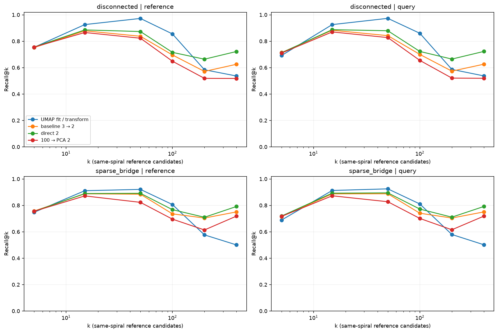

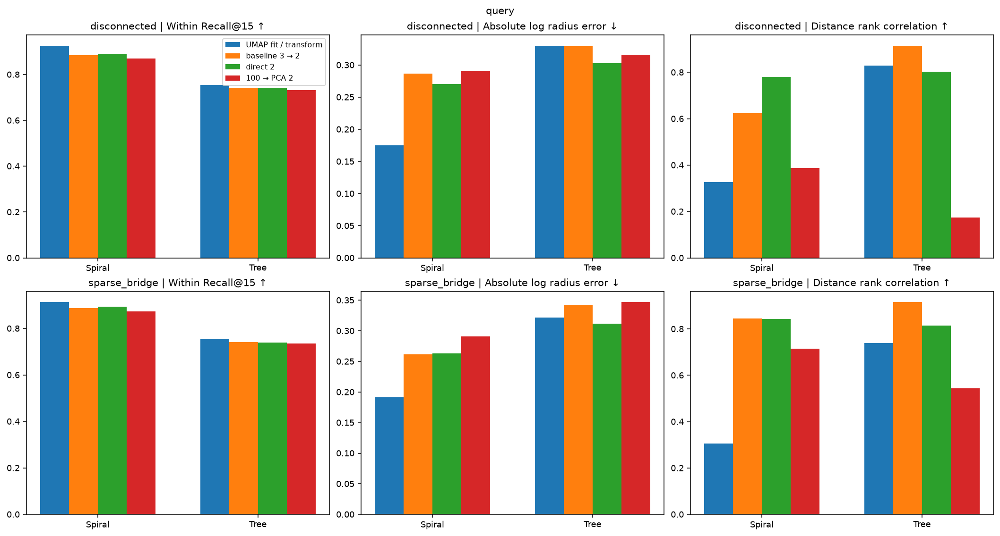

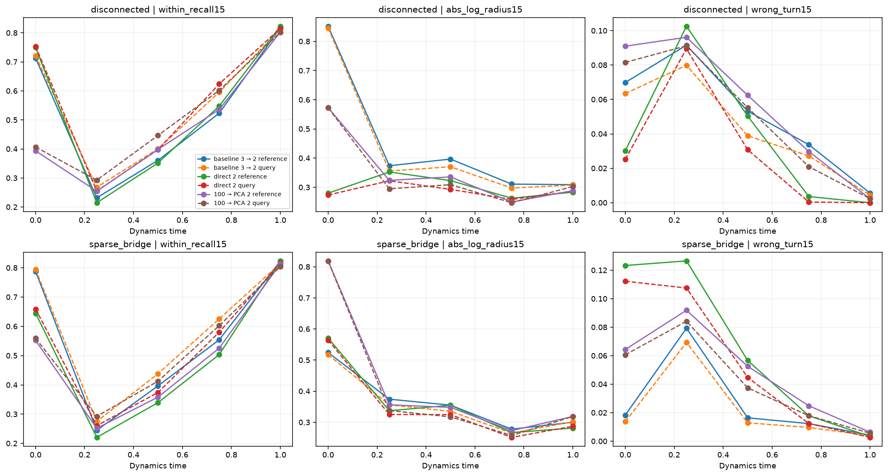

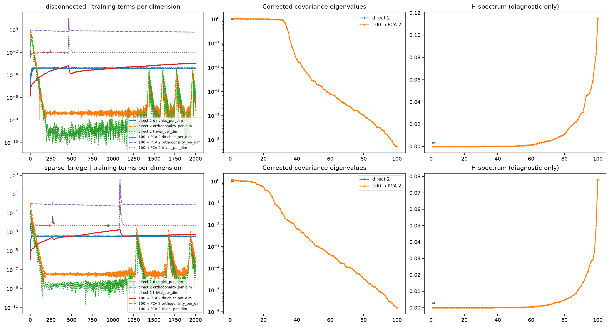

### disconnected

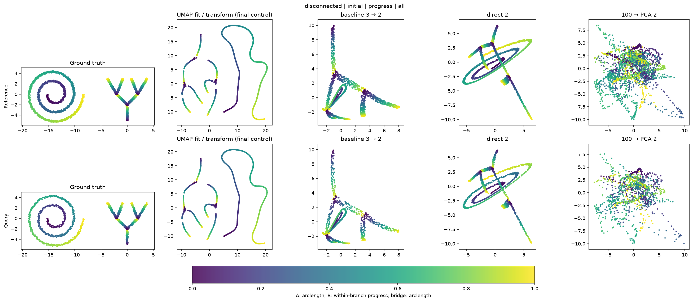

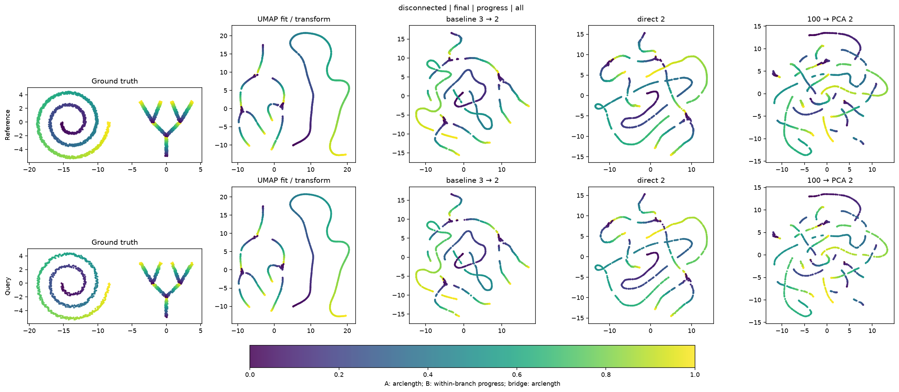

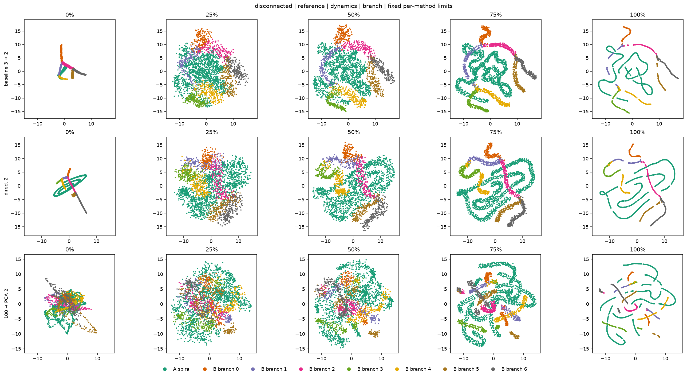

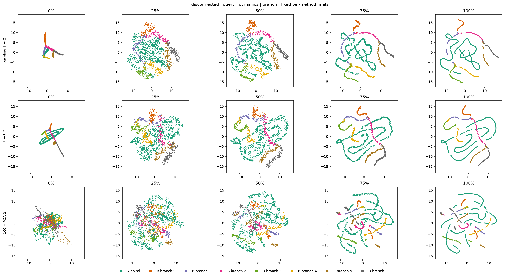

### sparse_bridge

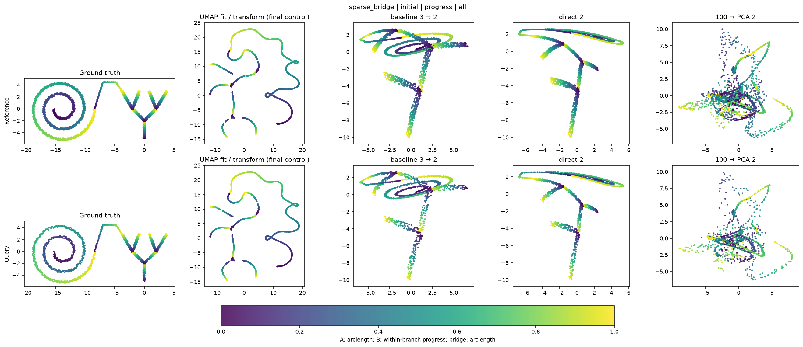

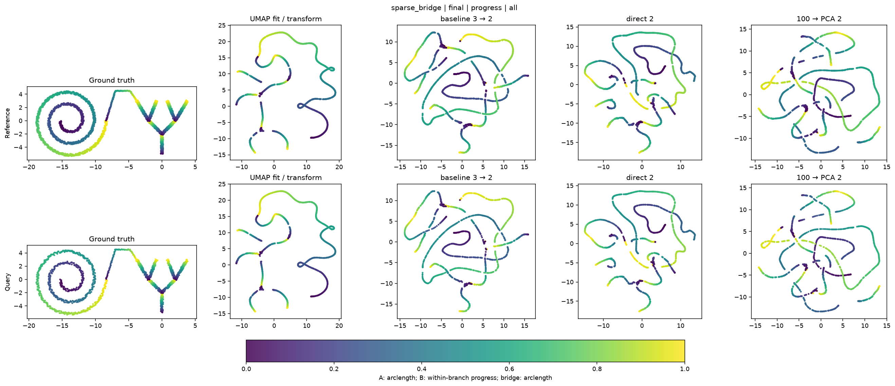

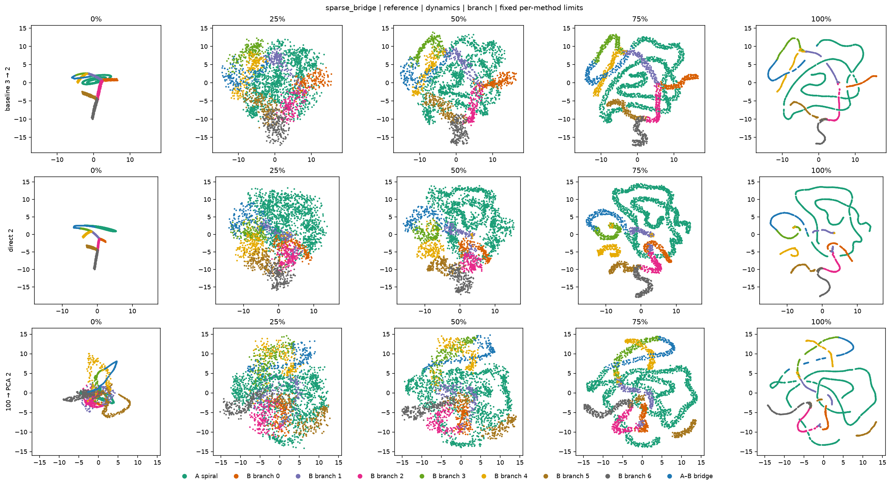

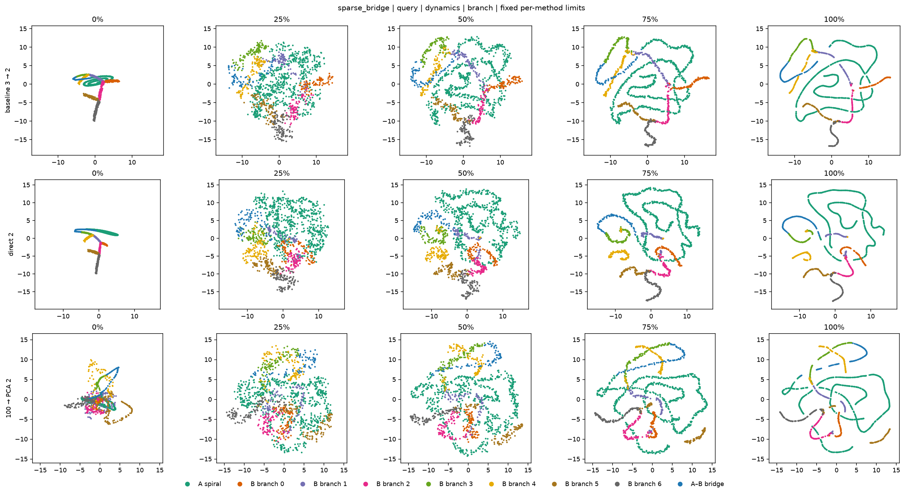

## 再実行・保存

```sh
.venv/bin/python SyntheticAnalysis/spectral_dimension_comparison/scripts/experiment.py
# 完成モデル/埋め込みを再利用して再開
.venv/bin/python SyntheticAnalysis/spectral_dimension_comparison/scripts/experiment.py --run SyntheticAnalysis/spectral_dimension_comparison/20260918T050303_435816Z
# 評価・作図・報告のみ
.venv/bin/python SyntheticAnalysis/spectral_dimension_comparison/scripts/experiment.py --run SyntheticAnalysis/spectral_dimension_comparison/20260918T050303_435816Z --phase analyze
```

configs/固定設定、data/元データと共有検索結果、models/新Spectral・較正・trajectory・各FitGrid反発モデル、embeddings/各stage reference/query、metrics/点別・集計・固定点対、figures/PNG、logs/監査・ソース・所要時間。Spectralは完成モデル単位、反発ネットは250stepsチェックポイント単位、queryは完成方式単位で再利用。

実行開始から報告まで 7.60 分。必須2データ条件×2新方式と既存baseline比較を完了。未実施は追加seedによる再現性検証。main merge・既存run上書きはありません。

## Gitへの保存範囲

コード、設定、元データ、各stageの最終保存済み埋め込み、評価結果、PNG35枚、診断・ログ・報告を含めます。学習済みモデルbinary、reference memory、optimizerチェックポイントは従来と同様にローカルへ保持します。上記の完全な再開・監査コマンドはローカルモデルを必要とします。
